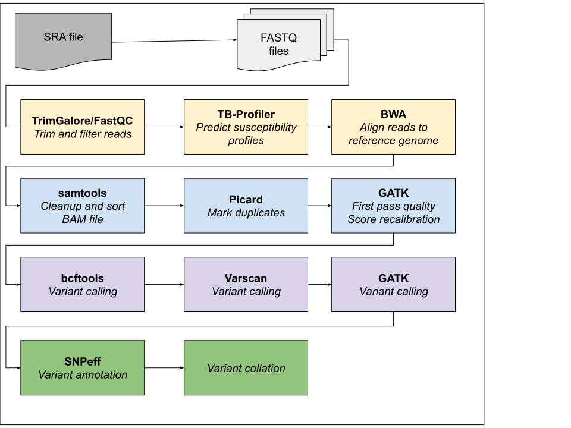

# BWA pipeline - Genomics pipeline based on BWA (Burrows Wheeler Alignment)

# Description



# Dependencies

  * TrimGalore 0.6.10
  * Picard 2.27.5
  * VarScan >= 2.3.9
  * BWA 0.7.17
  * BCFTools/HtsLib 1.18
  * SAMtools 1.6
  * GATK 4.3.0.0
  * snpEff >= 5.1d
  * Python modules: globalsearch

# Running

Edit bwa_config.json for the paths to your data, results and tools.
Then execute

```shell
./bwa_pipeline.py <directory in data_dir>
```

