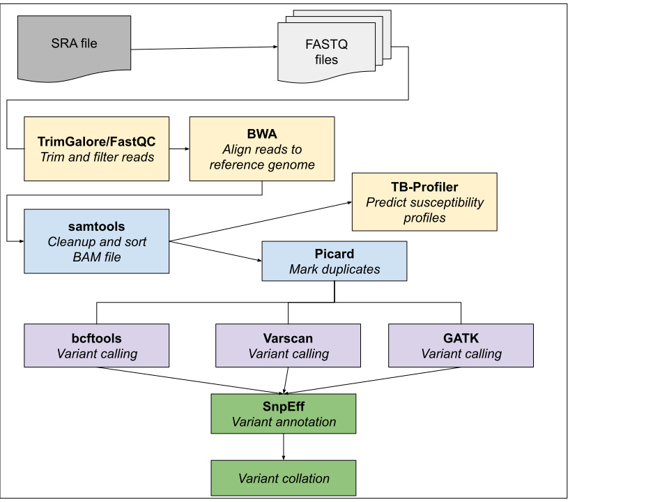

# BWA pipeline - Genomics pipeline based on BWA (Burrows Wheeler Alignment)

# Description



# Dependencies

  * TrimGalore 0.6.10
  * Picard 2.27.5
  * VarScan >= 2.3.9
  * BWA 0.7.17
  * BCFTools/HtsLib 1.18
  * SAMtools 1.6
  * GATK 4.3.0.0
  * snpEff >= 5.1d
  * Python modules: globalsearch

# Running

Edit bwa_config.json for the paths to your data, results and tools.
Then execute

```shell
./bwa_pipeline.py <directory in data_dir>
```

# Note

The subdirectory "reference" is expected in rundir to store the reference genome.
It needs to be writable so an index can be generated and written in this directory

The bwa_pipeline.py contains a renaming step, for the case if the chromosome name
in the references genome is inconsistent with the snpEff database.
We expect a file "chrom_names.txt" in the reference genome, which is a text file of the
format

CHROMOSOME_NAME_VARSCANDB<SPACE>CHROMOSOME_NAME_REFERENCE

If it does not exist, there will be empty results
